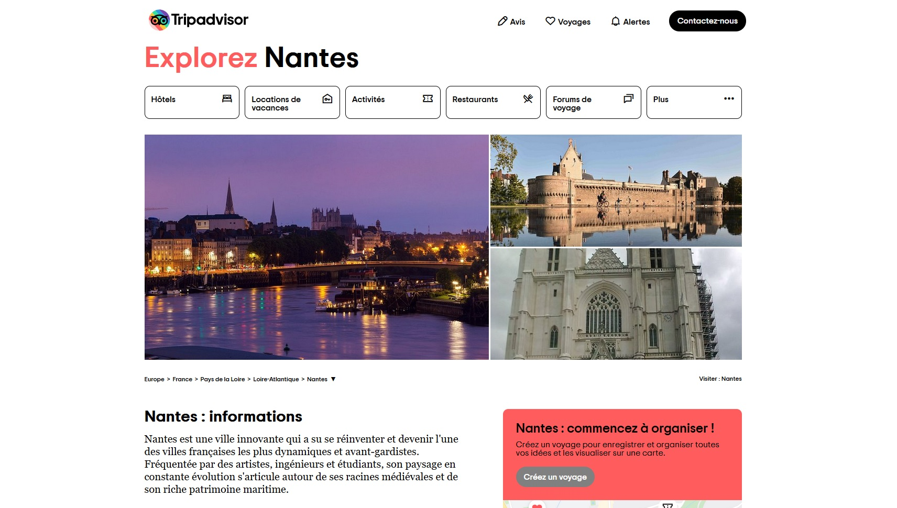
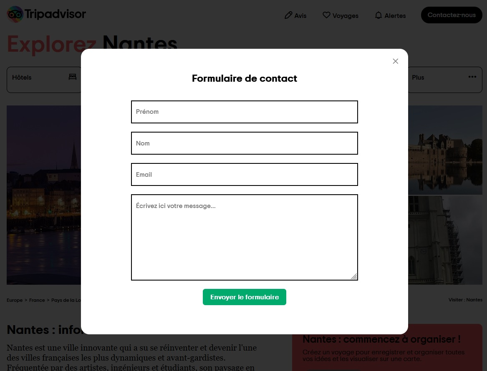

# Tripadvisor

 : <a href="https://helpful-kashata-5e27b6.netlify.app/" target="_blank">https://helpful-kashata-5e27b6.netlify.app/</a>

A single page made with HTML, CSS and Vanilla JS.

## Modal

When you complete and submit the form, I receive a mail directly in my box (made with Mailgun).

